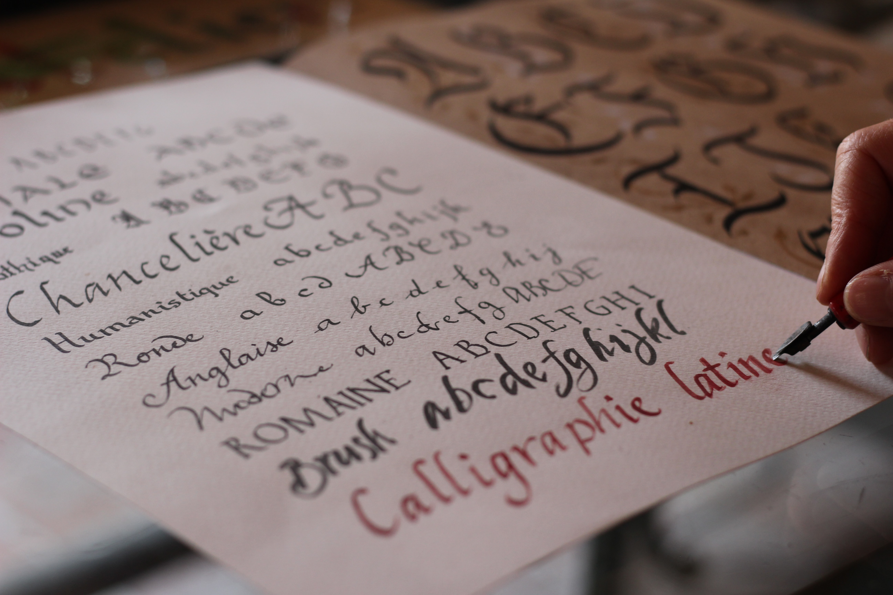

Graphology: derived from the Greek words 'graphein' (to write) and 'logos' (account) and it is the study of handwriting, a tool that can help to determine someone's personality.

**A bit of the history**

The interest of the inner meaning of writing is ascient, Greek and Roman philosophers believed writing could revel important aspects of the character and abilities of individuals.

The means of knowing the habits and qualities of a writer from his letters in 1622 by Camilo Baldi was the major first work on the topic by that time. Later in 1872, modern graphology was initiated by French clergy and the work, *The mysteries of handwriting* and *A system of graphology* was published by Abbe Jean Michon, who also funded the first school of graphology in 1871.

Between 1870 to 1930 graphology was used in Germany as a tool to experiment and diagnose psychiatric diseases.

> *A basic idea in all attempts to capture the soul had been that movements of the body express the status and movements of the soul.*

In the early twentieth century handwriting was still considered to express the soul, the character or the personality of the writer, but the soul was now reinterpreted as having a physical cause, which could be traced back to the brain.

The German psychiatrist Emil Kraepelin invented an apparatus, called Writing-Scale, which could help him to measure the dynamics of writing in various dimensions, especially the pressure of movements. The experiments produced a huge amount of data, but the psychiatrists were unable to interpret them in a comprehensible way.

Graphology became a diagnostic tool in psychology and psychiatry in the 1940s and 1950s. Like the Rorschach inkblot test, handwriting became a kind of projective test as they believed anyone who writes is involuntarily projecting his or her personality in the act she or he performs.

In other studies graphology has been proven to be useful in assessing major depression, high blood pressure and schizophrenia. Some experts have even found graphotherapy, consisting in handwritten exercises, to be helpful to adults with insomnia, as it shows  a more positive state of mind when repeated over a period of three weeks. 

In the actuality, some companies use graphology during recruitment processes and the methods have also been used in court cases. Although new observations have been discovered, there is still a lot to be learnt in order to understand better how graphology works.