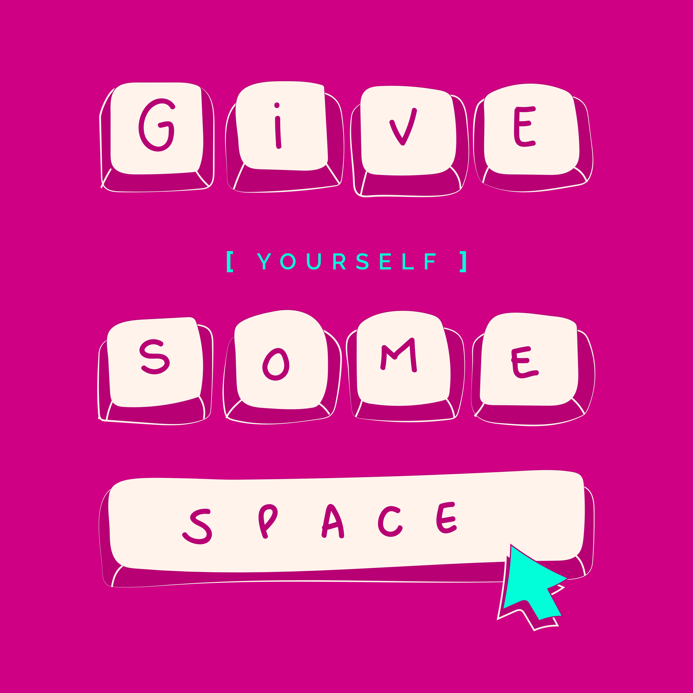

Did you know that a typeface can significantly influence what the reader thinks about you? Previously I mentioned graphology, which is the pseudo-scientific practice that has been around for over 200 years and how it can help to determinate psychiatric diseases and the personality of the writer. In this article I will compare it to the psychology of font and I will teach you how to find clues to our identities.

The National Pen Company in the US, reported that your hand writing can give clues about 5,000 personality traits. Some of the main clues are focused on: 

Size:

\-Small letters: you are **shy** or withdrawn, **studious, concentrated or meticulous**.

\-Spacing between words:

Wide spacing: you **enjoy your freedom** and don’t like to be overwhelmed or crowded.
Narrow spacing: You **can’t stand to be alone.**

Pressure:

* Heavy pressure: you are **good with commitment** and taking things seriously. If the pressure is too heavy, you tend to be uptight and can react quickly to criticism. 
* Light pressure: you are **sensitive** and show an empathy to people, but you also have lack of vitality.

Speed:

* If you write quickly: you are **impatient**, dislike delays or time wasters.
* If you write slowly: you are more **organised**, methodical and self-reliant.

Shape of the letter:

* Rounded letters: you are **creative** and artistic.
* Pointed letters: you are more **aggressive**, intense, very intelligent and curious.
* Connected letters: you are **logical**, systematic and make decisions carefully.

On the other side, some experts argue that the font chosen to write your emails and typewriting letters can say more about your personality than your creative writing skills. Due to the demise of handwriting, many experts have moved to typefaces to find new clues to deduce personality.

“The Psychology of Fonts”, written by psychologist Dr Aric Sigman explains how a typeface will significantly influence what the reader thinks about you.  

The study suggests fonts can be matched to your personality, for example:

Courier: sensible.

Georgia: pop chick.

Helvetica: modern.

Times New Roman: truswhorty and respectable.

Verdana: professional yet appealing.

A font can also be used in order to represent the conversation that you want to have. For instance, when applying for a job Times is a good font option to use on your cv if it is for a traditional company and Verdana for a contemporary firm.
Dr Sigman said: "Using the wrong font may give people the wrong impression about you and could affect decisions that will shape your future."
That is why learning how to use the right font style can help people to express fully and give a better impression of themselves.