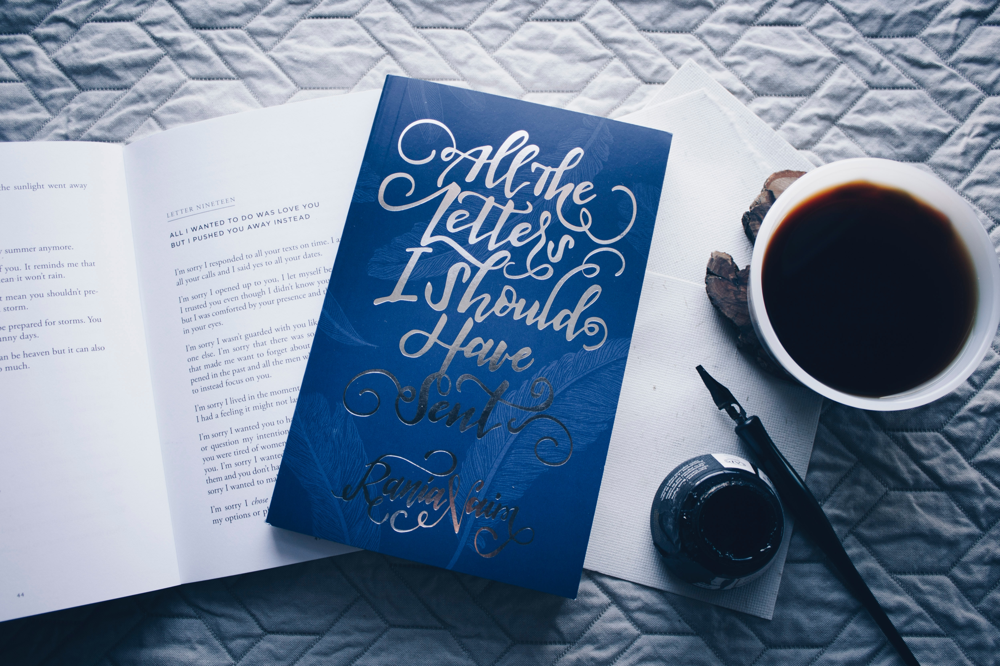
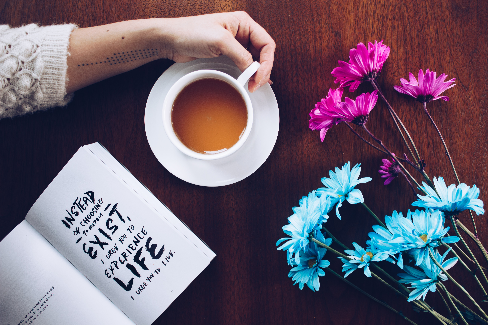
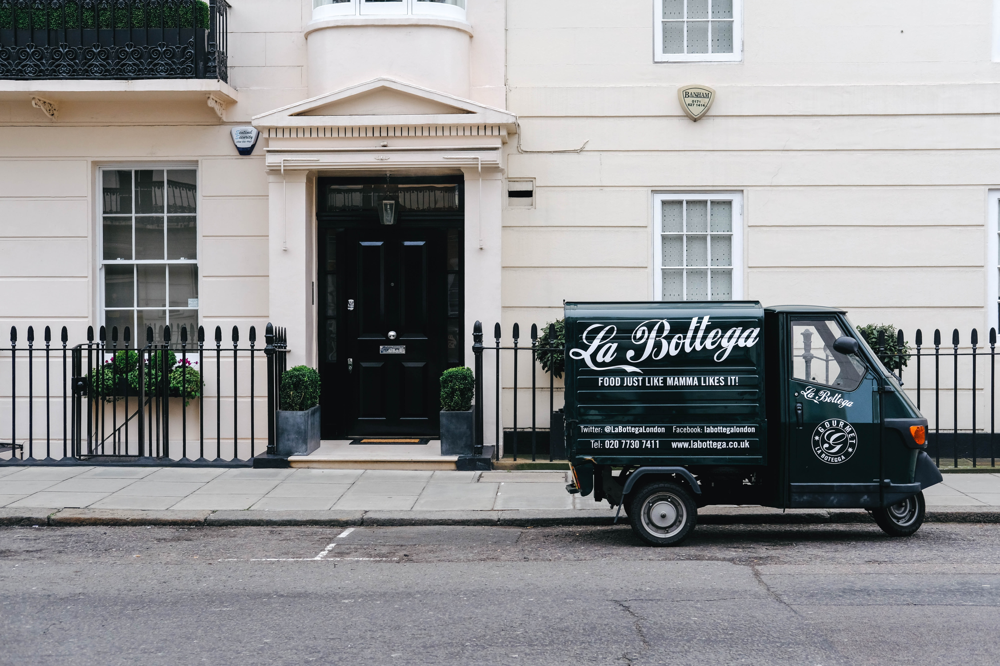

Is it lettering the same as typography or calligraphy? Although typography and lettering share many of the same concepts they are completely different disciplines. Understanding how lettering works and how to use it can be a huge benefit for a designer. 

Lettering can be simply defined as “the art of drawing letters”. The difference between a type designer and a lettering artist is that the first one designs the letters to be used repetitively, while the lettering artist draws letters for a single usage. Usually lettering is hand-drawn, but some artists start their work directly with Adobe Illustrator.

Typography is used for endless applications from titles to body text, while lettering is mostly used as a display text as it would take a lot of effort to use it for writing paragraphs. 

The arts of both lettering and calligraphy have been around since time immemorial and have evolved together.
Again, although calligraphy and lettering are related, they are not the same. To explain it in simple words calligraphy is essentially based on writing letters, and lettering is drawing letters. One of the biggest differences is that calligraphy aims at the perfection of style while lettering is popular due to the freedom of the presentation, it is original and not constrained by a certain style so the artist can create something original and different to anything else.

In actuality, because of the high competition, a client product may have to innovate and think about new strategies to stand out. For this reason, many designers choose to offer a lettering slogan as it could attract the attention of new customers.

One of the main benefits is that because the design is original, people can memorise and distinguish the slogan quicker and associate it with the product. 

In addition, beautiful and original lettering can give a pleasant first impression of a brand, which is really important as a business can’t survive without the brand awareness and loyalty. 

To conclude lettering is an effective way to design unique, aesthetic, and recognizable brand identity. It is a great strategy as it brings to a business everything made by hands, which can never be repeated once again. If you would like to give it a try,  [this website](https://lettering.org/lettering-generator/) is a great start for beginners as it allows you to create great hand letterings as a template or to draw along directly in an easy way!