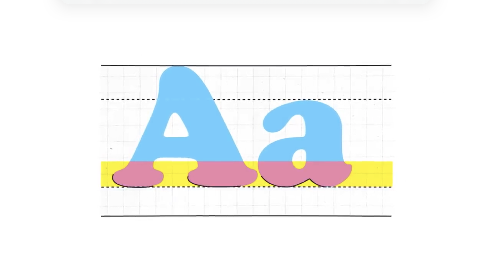
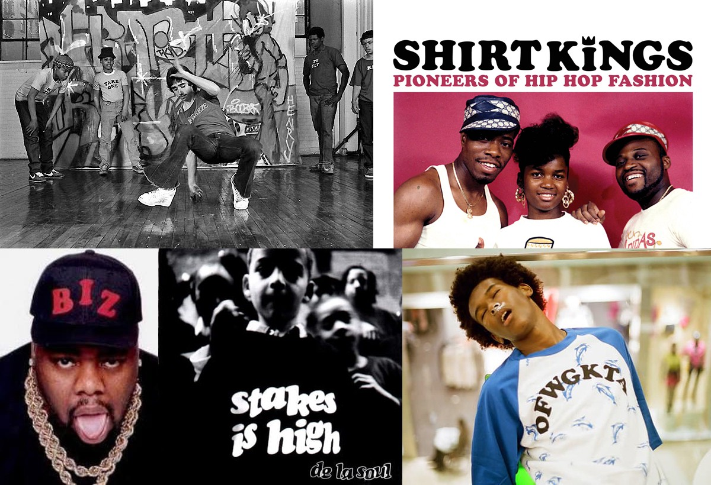
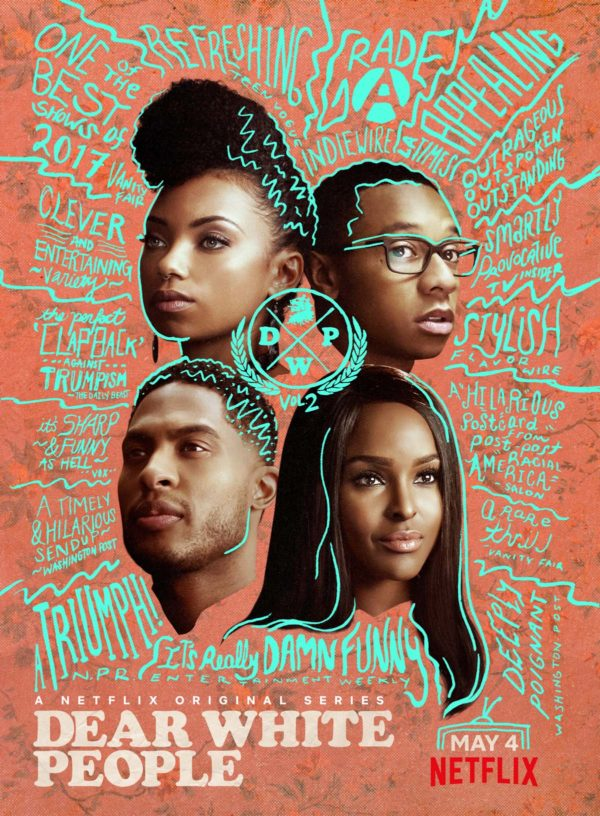

Despite the changes in the technology and pop culture, this typeface has been around for centuries. If you haven't noticed yet, you will see that you can find it everywhere, including candy wrappers, corner store signs, movie posters, album covers and many others. In this post I will explain more about the reason and the history of this famous font.

**The history**

In 1919 with the end of the First World War, there was a big increase in product and demand. Wood and metal were the products used for commercial printing were metal and wood. Wood was used mainly for large posters, while metal was created to be used for tiny letters and was the one used the most for commercial and publishing purposes. The words were cast into small lines of text, which was useful for more precise blocks of type.
In 1918, after years of making hand letter ad designs for banks and car companies, the typeface dubbed Cooper was designed by an illustrator called Oswald Cooper.

It took a classic Roman Form and softened the edges. Not long after his success, the type foundry Banhart Brothers and Spindler asked him to make a bold display typeface based on the font and around 1920, Oswald Cooper released Cooper Black. After that it was considered one of the most popular typeface designs of the time. 

**What made it work so well** 

**Versatility**: It doesn’t need to be on a straight like to look good, it works well big and small.

**Curves**: it has an unconventional aspect, as it has no flat bottom. The baseline serif of one character naturally flows right into the curve of another.

**Space**: the negative spaces within each character made it look incredibly light and friendly, while still commanding for attention. 

**Legibility**: Unless other typefaces at the time, with Cooper Black you can make the letter as bold as possible for and it will still maintain the legibility.

Oswald Cooper also believed Cooper Black was at its best when the letters were all crammed together. 
Cooper Black moved from being the font of Burger King, posters and magazine to become the font used for posters created by the counter cultural movement. 

The fluidity and boldness makes this font special, and these cultural posters are the perfect example of Cooper Blacks adaptability and legacy.

That is why Cooper Black is just as popular today as how it was when first created.