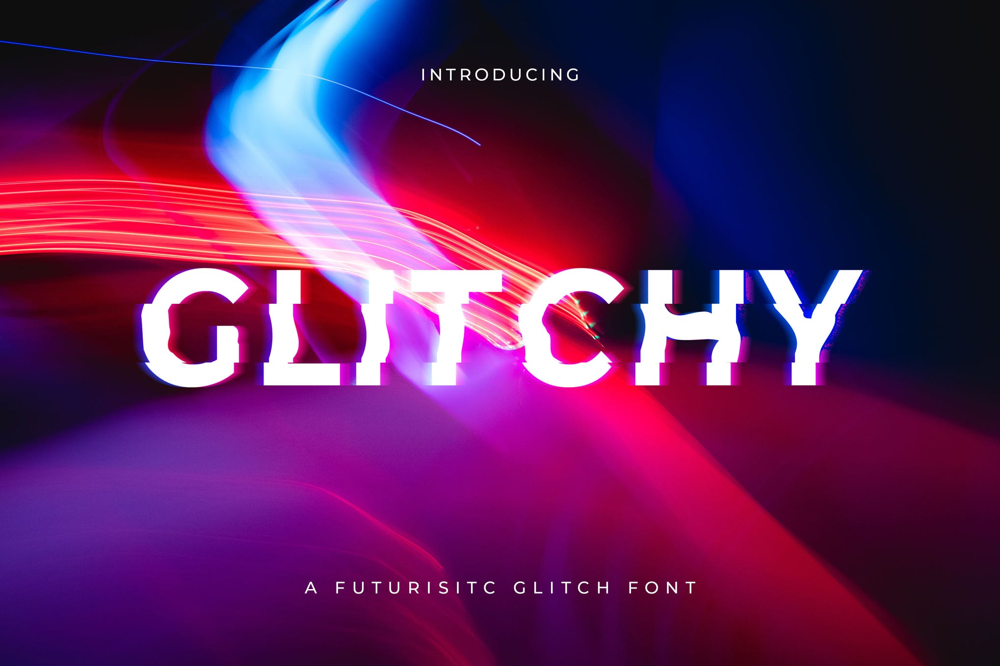
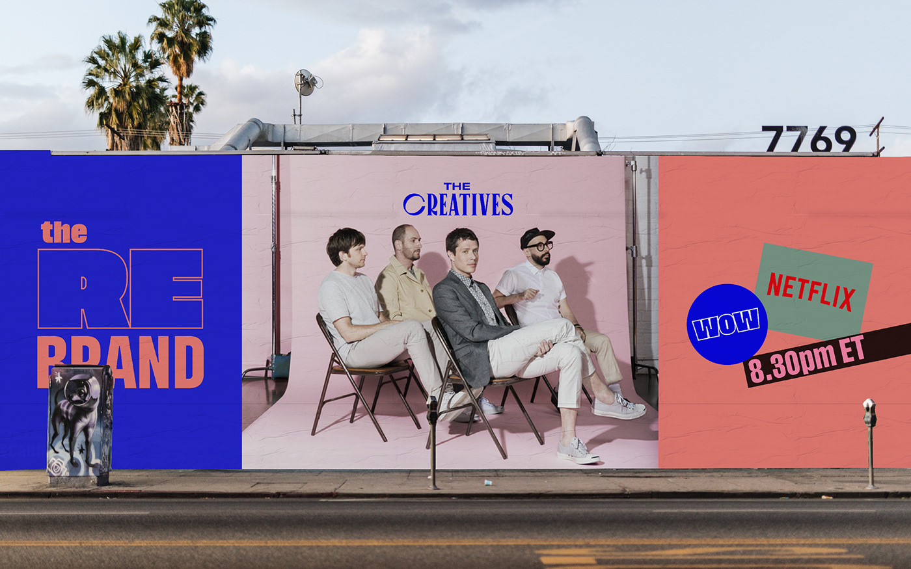
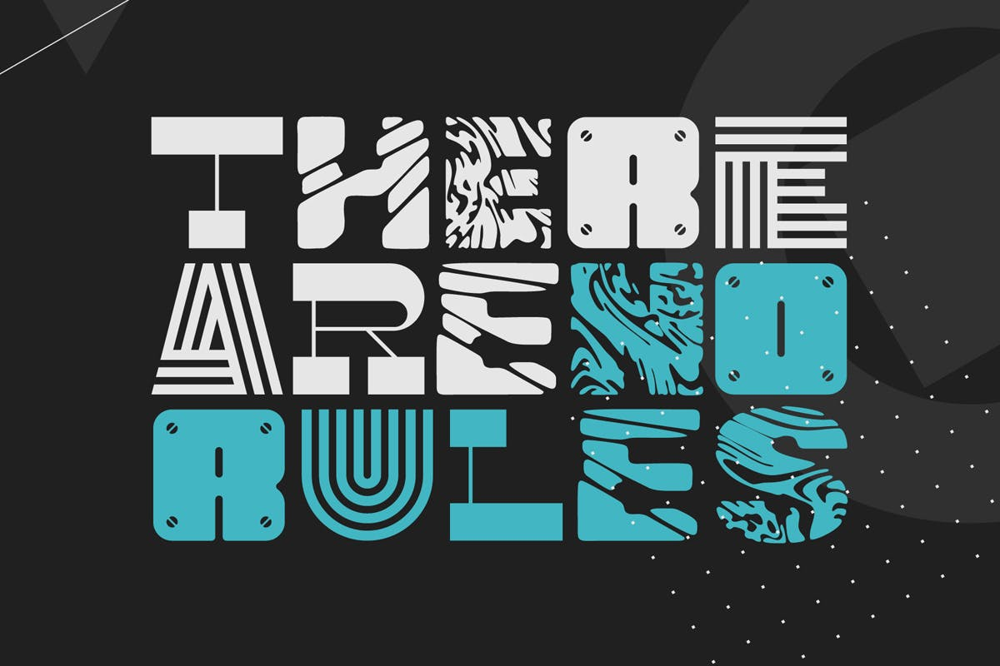
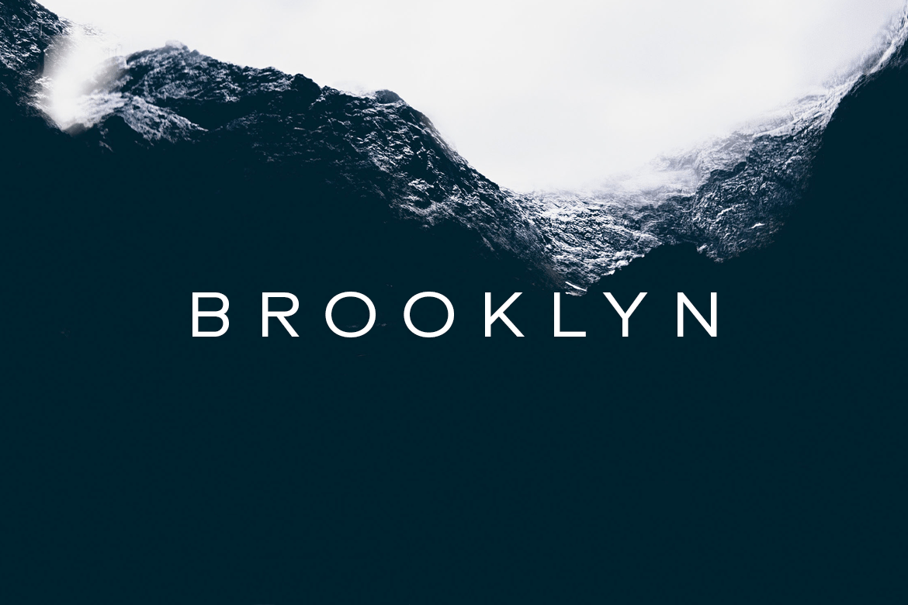
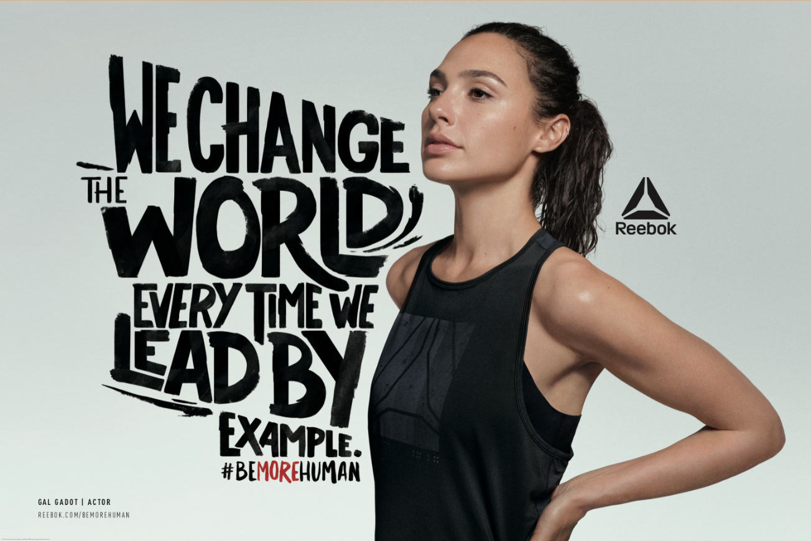
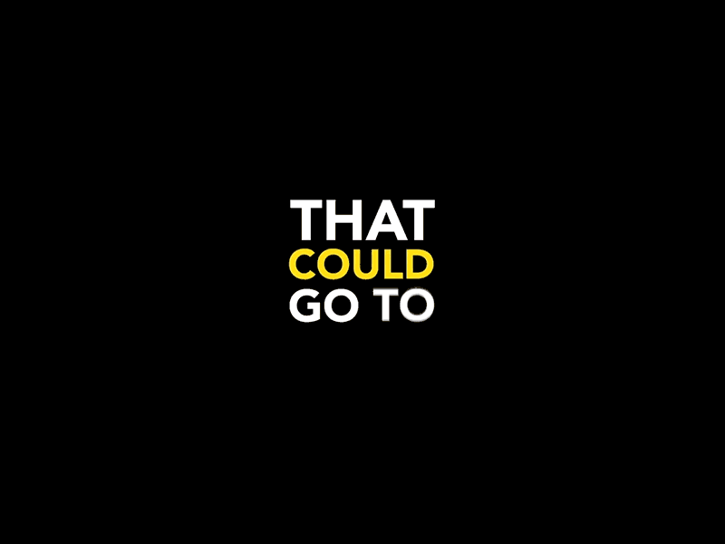

While some designers are embracing technology to innovate fonts, others are mining the past to resurrect and reframe trends for the modern world. Here I will show you the typography trends of 2020.

Retro fonts: fonts from the 80s and 90s are being reintroduced into design, they are bold with tight kerning and range from older looking serif fonts, to more creative fonts that would have looked futuristic in their day. Glitchy by Andrewtimothy is a futuristic glitch sci-fi font. An elegant sans serif with waves of distortion applied to add an overlay of glinch on each letter's shape.

Outline fonts: outline fonts have been gracing the pages of fashion magazines and animated news graphics lately. Designers have been blending the effect with negative space, using images to fill the shapes of letterforms in a style that is both bold and airy. The rebrand has used an outline font in their logo, emphasizing the "re" of 'rebrand'. It is bold, fresh and a bit retro, which makes the logo really stand out.

Experimental fonts: this trend is all about pushing design boundaries to their limits, and many designers have been tapping into the most creative experimental typography techniques to evoke an edgy and rebellious tone. No rules by Gleb_Guralnyk its an unconventional font, each letter automatically switches to a different variation, mixing striped fonts and characters with various patterns.

Minimalists fonts: many type designers are experimenting with negative space and removing the eyes and crossbars of letterforms to create more expansive shapes. Modern, simple sans serif fonts are a safe choice everywhere and it will remain like that. Designova has created this minimal font "Brooklyn", its classic geometric design is perfect for elegant portfolios and branding designs.

Hand-written fonts: hand-written fonts are resurging as a reprieve to our over-digitalized world. There is a rise in unique and rustic hand-lettered typography as more designers dabble in this increasingly creative and ilustrative style. Reebok has used hand-written fonts in a campaign called " be more human", it uses the fonts to make the message of each celebrity part of the campaign stand out.

Kinetic fonts: as I mentioned in my previous post, combines old-fashioned typography with the power of video and animation in order to create really eye-catching, memorable designs. Unlike standard type, a designer working with kinetic type has to also take into account style, effects and timing in addition to normal considerations like alignment, weight, and hierarchy. If you want to learn more about creative font, don'

t forget to read my [previous article](https://typographyspace.netlify.app/2020/11/16/what-is-kinetic-typography-animation/) for more information