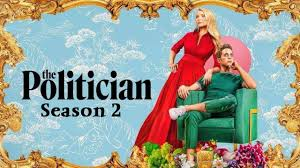

While some designers are embracing technology to innovate fonts, others are mining the past to resurrect and reframe trends for the modern world. Here I will show you the typography trends of 2020.

1. Retro fonts: fonts from the 80s and 90s are being reintroduced into design, they are bold with tight kerning and range from older looking serif fonts, to more creative fonts that would have looked futuristic in their day. Glitchy by Andrewtimothy is a futuristic glitch sci-fi font. An elegant sans serif with waves of distortion applied to add an overlay of glinch on each letter's shape.

2. Outline fonts: outline fonts have been gracing the pages of fashion magazines and animated news graphics lately. Designers have been blending the effect with negative space, using images to fill the shapes of letterforms in a style that is both bold and airy. The rebrand has used an outline font in their logo, emphasizing the "re" of 'rebrand'. It is bold, fresh and a bit retro, which makes the logo really stand out.

3. Experimental fonts: this trend is all about pushing design boundaries to their limits, and many designers have been tapping into the most creative experimental typography techniques to evoke an edgy and rebellious tone.

