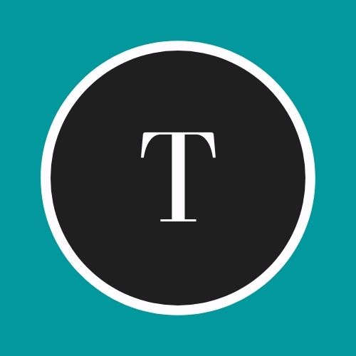
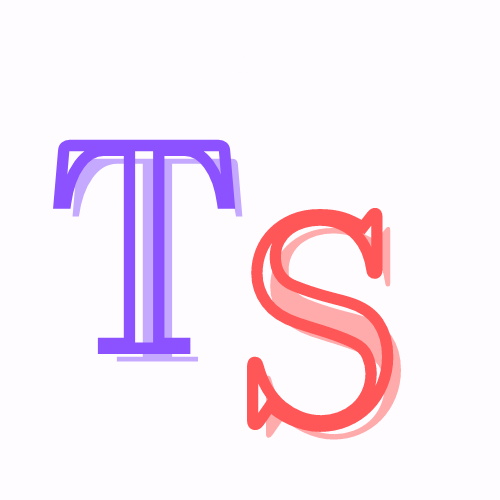
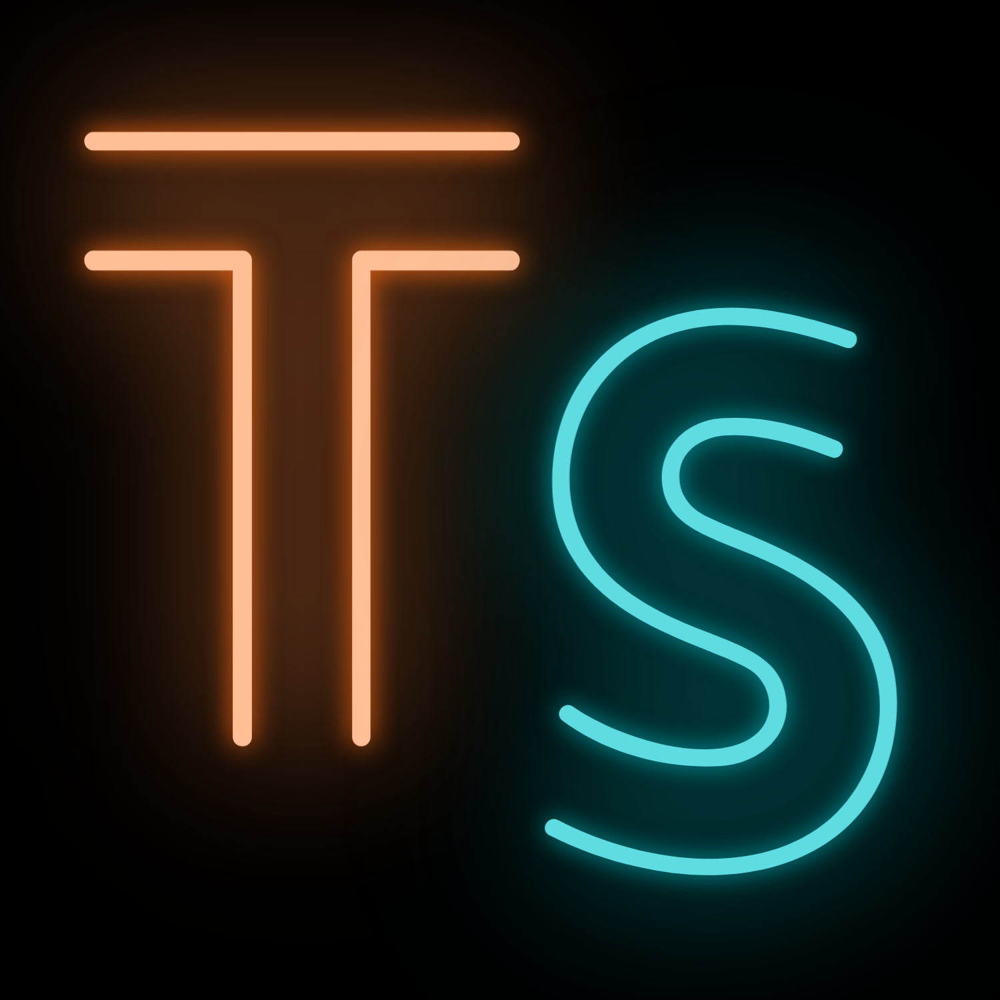

Welcome to my blog!

My name is Daniela and I am a second year Publishing, Journalism and Media student at Oxford Brookes University. On this website I will be posting interesting and fun facts about typography for my university assignment. One of my personal aims is to be able to learn as much as possible about typography as it is a new topic for me. Therefore, every new article would be a new fact that I would learn and share with the viewers.

For the design of my website I used neon bright colours because I want to make the website look eye-catching and intensify the idea of leaning about typography in a fun way, as fluorescent neon colors inject excitement and energy into designs!

For the logo I designed three different types, and I finally chose the last one as I think it matches better with the palettes and the idea I mentioned before.

**\
Electric blue** can feel calm and tranquil and pairs beautifully with **electric orange.** I decided to add also an S for "space" as it could have more impact. Then I chose a black background instead of a white one like in the second logo as I think it makes it look more elegant and it helps the colours to look more intense. I also changed the font to Lovelo Line, as it looks more appealing and modern. I wanted to keep the logo simple and memorable, one of the reasons is because the website banner also has many colours and different shapes. On the other side, the posts that I added have colorful images so I did not want to exhaust the viewer making it seem too much!

Finally, for the imagery I used *Unsplash* to find the best pictures, this is a free website dedicated to sharing stock photography.

I hope you find this blog interesting, feel free to contact me if you have any questions, ideas for would like to collab.